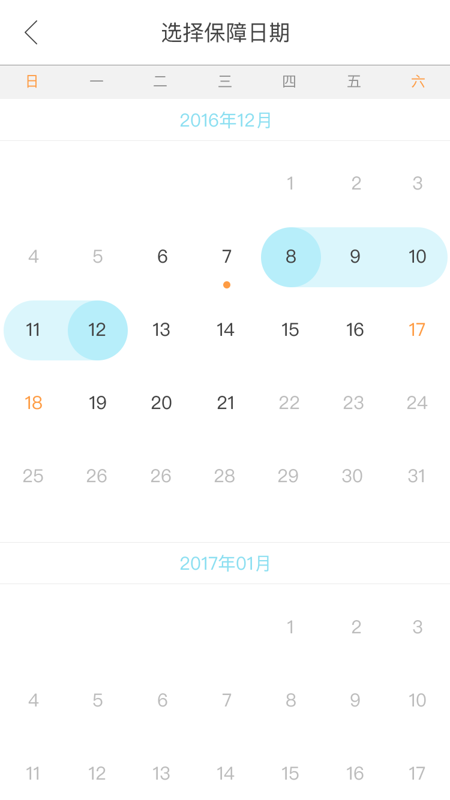
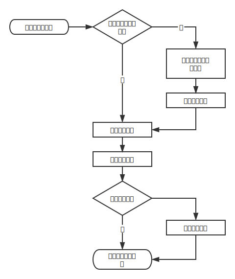

<!--
title: date-picker-tutorail
description: a full tutorail of date-picker
-->

## 实战
# 手机日历组件

#### [@meathill](https://weibo.com/meathill/)

<!-- page -->

{{> author}}

<!-- page -->

## 教学目标

通过学习本系列教程，可以了解现代化前端开发的方方面面：

1. 学会搭建开发环境，使用 Webpack、Babel、Stylus、Gulp 等工具
3. 了解测试驱动开发，学会写测试用例、自动化测试
4. 学会打包发布代码
5. 学会用 GitHub Pages 维护产品文档
6. 学会写类似的组件

<!-- page -->

## 课程大纲

1. 项目启动 & 需求分析
2. npm & package.json
3. Stylus
4. 静态 HTML 开发

<!-- section -->

5. Webpack + Babel 配置
6. 使用 ES6 开发 JavaScript
7. 使用 Mocha + should.js 测试
<!-- .element: start="5" -->

<!-- section -->

8. 使用 Handlebars 处理模板
9. 完成 UI 开发和测试
10. 使用策略模式解决分支需求
<!-- .element: start="8" -->

<!-- section -->

11. Gulp 打包
12. 配置 Webpack 适应不同环境的打包 
13. 使用 Weinre 解决微信下的问题
<!-- .elment: start="11" -->

<!-- section -->

14. 使用 GitHub Pages 搭建文档网站
15. 回顾，总结
<!-- .element: start="13" -->

<!-- page -->

## 第一讲

1. 项目启动 & 需求分析
2. NPM & package.json 
3. Stylus
4. 开发静态 HTML

<!-- page -->

## 需求分析

<!-- section -->

  

    <!-- .element: height="600" -->
  

  

    <ol>
      <li>开发一个日历控件</li>
      <li>主要在手机浏览器中使用，包括公众号</li>
      <li>点击日期输入框，弹出控件，选择日期，收起控件</li>
      <li>尽量独立，少依赖，少引入框架</li>
      <li>样式如图</li>
    </ol>
  

<!-- section -->

### 通用规则

1. 今日用黄点标记
2. 不可选的日期为灰色
3. 打开关闭都需要动画
4. 周末用橙色标记
5. 可以指定某个日期为橙色（端午节、清明节等）
6. 向上滚屏可以自动增加下个月
7. 可以用参数配置

<!-- section -->

### 选择单日

1. 点击日期视为选中
2. 点击同一日期视为取消
3. 点击其它日期视为多选
4. 若自动提交，点够数量就提交
5. 不自动提交，右上角有提交按钮，点击后提交

<!-- section -->

### 选择多日

1. 第一次点击时，视为选择时间段的一端，第二次点击为选择另一端
2. 允许用户先选择终点，再选择起点
3. 若自动提交，第二次点击后，控件伴随着动画关闭
4. 不自动提交，第三次点击会清空之前的选择，并重新选择起点

<!-- page -->

## 技术选型

1. 开发效率
2. 使用效率
3. 维护成本

<!-- section -->

### jQuery

1. 事件代理
2. 创建 DOM
3. 简单的 DOM 操作

<!-- section -->

### 模板引擎 Handlebars

1. 预编译
2. 比较熟

<!-- section -->

### Stylus -> CSS

1. 使用预处理工具，方便开发
2. 简单方便快捷，基于 Node.js
3. 支持变量、函数、循环
4. 丰富的内建函数

<!-- section -->

### 语言

1. ES6 Class
2. Webpack + Babel
4. 完整的测试用例

<!-- section -->

### 提交物料

1. 最终文件 CSS、JS 各一个
2. 源代码
3. 使用文档

<!-- page -->

## 这套方案的优势

1. 使用比较简单，嵌入资源文件即可
2. 使用 jQuery，前后兼容性好，对方容易接手
3. 源代码保持最大的弹性，方便扩展开发
4. 

<!-- page -->

## 工作流程

1. 将事件绑定在 `<body>` 上
2. 配置信息使用 `data-*` 写在 `<input>` 上
3. 用户点击 `input[type=text].tqb-date-picker` 后
    1. 如果此文本框尚无日历元素
    2. 则生成一个元素并绑定
4. 弹出日历窗口
5. 用户点击后选中日期

<!-- section -->

<!-- .element: class="bg-w" -->

<!-- page -->

## 开工！！

<!-- page -->

## 1. 初始化项目

<!-- section -->

### NPM

Node Package Manager = Node 包管理工具

1. 管理依赖
2. 发布我们自己的包
3. 记录常用脚本

<!-- section -->

### package.json

此项目的配置信息，可被 NPM 读取。

1. 版本、内容、作者等描述
2. 依赖：运行时依赖 & 开发时依赖
3. 可执行脚本

<!-- page -->

## 2. 配置 Stylus

<!-- page -->

### 3. 开发静态 HTML

<!-- page -->

Q&A

<!-- page -->

## 第二讲

<!-- page -->

完整项目代码仓库：

* [Github meathill-freelance/date-picker](https://github.com/meathill-freelance/date-picker)
* [线上文档](https://meathill-freelance.github.io/data-picker/)

<!-- page -->

参考阅读：

* [Using a package.json](https://docs.npmjs.com/getting-started/using-a-package.json)
* [Stylus](http://stylus-lang.com/)
